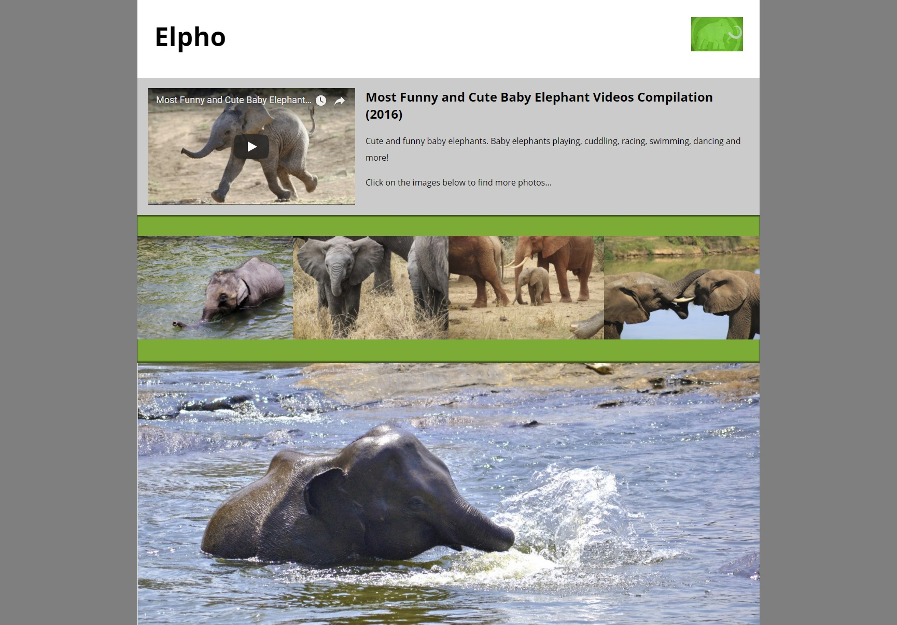

# HTML - Responzívne obrázky

O responzívnych obrázkoch som rozprával na prednáške, [slajdami si pripomeňte základné princípy a podporu v HTML5](/prednasky/zdroje/02-WT-html.pdf).

## Príklady na precvičenie

### Príklad
Vašou úlohou je pridať video a obrázky do predpripravenej šablóny.
 Stiahnite si:
 * súbor [index.html](zdroje/index.html)
 * CSS štýly - súbor [responsive-images-basic.css](zdroje/responsive-images-basic.css)
 * obrázok s logom [elephants_logo-100.jpg](zdroje/elephants_logo-100.jpg) 
 
Je potrebné spraviť nasledujúce:

* pomocou grafického editora vytvorte 400px a 120px široký variant týchto obrázkov:
  * [elephant_baby_1.jpg](zdroje/elephant_baby_1.jpg) (elephant_baby_1-400.jpg, elephant_baby_1-120.jpg)
  * [elephant_baby_2.jpg](zdroje/elephant_baby_2.jpg) (elephant_baby_2-400.jpg, elephant_baby_2-120.jpg)
  * [elephant_baby_3.jpg](zdroje/elephant_baby_3.jpg) (elephant_baby_3-400.jpg, elephant_baby_3-120.jpg)
  * [elephant_baby_4.jpg](zdroje/elephant_baby_4.jpg) (elephant_baby_4-400.jpg, elephant_baby_4-120.jpg)
  
* ďalej vytvorte 1200px široký variant obrázku [elephant_baby_playing_main.jpg](zdroje/elephant_baby_playing_main.jpg) (elephant_baby_playing_main-1200.jpg) a tiež 600px široký "portrait" variant s detailom na slona (elephant_baby_playing_main-600.jpg, spomeňte si na problém prezývaný art direction)

* pridajte video do hlavného obsahu článku
  * vložte YouTube video z [tohto odkazu](https://www.youtube.com/watch?v=SNggmeilXDQ), pričom jeho šírka by mala byť 400px
  * hint: vložte video ako `iframe`, použite priamo YouTube funkcionalitu *EMBED* na vygenerovanie HTML kódu
  
* vo vnútri elementu `
` sú štyri `<a>` elementy, každý z nich odkazuje na pôvodný zdroj obrázku. Je potrebné vložiť do týchto elementov zodpovedajúce obrázky - elementy ``, ktoré majú správne definované atribúty `src`, `alt`, `srcset` a `sizes`.
    * 120px široký variant sa zobrazí, ak šírka viewportu je 480px alebo menej
    * 400px široký variant sa zobrazí v ostatných prípadoch

* vo vnútri elementu  `
` pridajte element `<picture>`, v ktorom definujete:
    * 600px variant obrázku [elephant_baby_playing_main.jpg](zdroje/elephant_baby_playing_main.jpg) sa zobrazí, ak šírka viewportu je 600px alebo menej  
    * 1200px variant obrázku [elephant_baby_playing_main.jpg](zdroje/elephant_baby_playing_main.jpg) sa zobrazí v ostatných prípadoch
    
Výsledok pre šírku okna 1200px by mal byť takýto:

Služba [tinypng](https://tinypng.com/) je dobrým pomocníkom pri optimalizácii veľkosti obrázkov so zachovaním kvality (dobrý balans medzi kvalitou a veľkosťou).