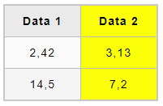

# HTML - Tabuľky

## Vytvorenie prvej tabuľky

Obsah každej tabuľky je obalený značkami `<table></table>`. Najmenším elementom tabuľky je bunka, ktorú vytvoríme elementom `<td>` (angl. table data). Riadok tabuľky vytvoríme tak, že bunku, resp. bunky tabuľky zaobalíme značkami `<tr></tr>` (angl. table row). Vytvorme tabuľku s 2 riadkami, kde každý riadok bude mať 4 bunky:

```html
<table>
    <tr>
      <td>Som 1. bunka v 1. riadku</td>
      <td>Som 2. bunka v 1. riadku</td>
      <td>Som 3. bunka v 1. riadku</td>
      <td>Som 4. bunka v 1. riadku</td>
    </tr>
    <tr>
      <td>Som 1. bunka v 2. riadku</td>
      <td>Som 2. bunka v 2. riadku</td>
      <td>Som 3. bunka v 2. riadku</td>
      <td>Som 4. bunka v 2. riadku</td>
    </tr>
</table>
```

V prehliadači výstup vyzerá takto (s použitím prednastavených štýlov Chrome):


Vyskúšajte pripojiť k HTML dokumentu [základné štýly tables-basic.css](zdroje/tabulky-zakladne-styly.css), ktoré naformátujú tabuľku tak, aby bola lepšie čitateľná:


## Pridanie hlavičky tabuľky

Hlavičku tabuľky tvoria  "špeciálne" bunky - `<th></th>` (angl. table header), ktoré sú na začiatku riadku alebo stĺpca, a definujú typ údajov, ktoré riadok alebo stĺpec obsahuje:

```html
<table>
    <tr>
        <th>Názov</th>
        <th>Hmotnosť (10<sup>24</sup>kg)</th>
        <th>Priemer (km)</th>
        <th>Hustota (kg/m<sup>3</sup>)</th>
    </tr>
    <tr>
        <td>Merkúr</td>
        <td>0,330</td>
        <td>4 879</td>
        <td>5427</td>
    </tr>
    <tr>
        <td>Venuša</td>
        <td>4,87</td>
        <td>12 104</td>
        <td>5 243</td>
    </tr>
</table>
```

Výstupom je tabuľka:


## Spojenie viacerých riadkov alebo stĺpcov
Niekedy potrebujeme spojiť viacero riadkov alebo stĺpcov. Toto je možné spraviť použitím atribútov `rowpan`, resp. `colspan`. Hodnotou obidvoch atribútov je číslo vyjadrujúce počet riadkov, resp. stĺpcov, ktoré chceme spojiť. Ilustrujme si to na príklade:

```html
<table>
    <tr>
        <td colspan="2"></td>
        <th>Názov</th>
        <th>Hmotnosť (10<sup>24</sup>kg)</th>
        <th>Priemer (km)</th>
        <th>Hustota (kg/m<sup>3</sup>)</th>
    </tr>
    <tr>
        <th rowspan="2" colspan="2">Terestriálne planéty</th>
        <td>Merkúr</td>
        <td>0,33</td>
        <td>4 879</td>
        <td>5 427</td>
    </tr>
    <tr>
        <td>Venuša</td>
        <td>4,87</td>
        <td>12 104</td>
        <td>5 243</td>
    </tr>
    <tr>
        <th rowspan="4">Jovské planéty</th>
        <th rowspan="2">Plynné planéty</th>
        <td>Jupiter</td>
        <td>1 898</td>
        <td>142 984</td>
        <td>1326</td>
    </tr>
    <tr>
        <td>Saturn</td>
        <td>568</td>
        <td>120 536</td>
        <td>687</td>
    </tr>
    <tr>
        <th rowspan="2">Ľadoví obri</th>
        <td scope="row">Urán</td>
        <td>86,8</td>
        <td>51 118</td>
        <td>1 271</td>
    </tr>
    <tr>
        <td scope="row">Neptún</td>
        <td>102</td>
        <td>49 528</td>
        <td>1 638</td>
    </tr>
</table>
```

Výstupom je tabuľka:


## Elementy `<colgroup>` a `<col>` na podporu štýlovania

Uvažujme takúto jednoduchú tabuľku:

```html
<table>
  <tr>
    <th>Data 1</th>
    <th style="background-color: yellow">Data 2</th>
  </tr>
  <tr>
    <td>2,42</td>
    <td style="background-color: yellow">3,13</td>
  </tr>
  <tr>
    <td>14,5</td>
    <td style="background-color: yellow">7,2</td>
  </tr>
</table>
```



V tabuľke je zvýraznený druhý stĺpec. Toto sme docielili tak, že sme pomocou atribútu `style` aplikovali CSS štýl - vlastnosť `background-color`. Atribúty `<colgroup>` a `<col>` umožňujú zjednodušiť štýlovanie, aby sme nemuseli štýl určovať explicitne pre každú bunku - je to neefektívne a komplikuje to potenciálne zmeny (pozn. ďalšou z možností je aj použitie CSS selektora `:nth-child()`).

Ukážme si, ako si môžeme pomôcť použitím elementov `colgroup` a `col`, uvažujme takýto príklad:

```html
<table>
  <colgroup>
    <col>
    <col style="background-color: yellow">
  </colgroup>
  <tr>
    <td>2,42</td>
    <td>3,13</td>
  </tr>
  <tr>
    <td>14,5</td>
    <td>7,2</td>
  </tr>
</table>
```

V elemente `<colgroup>` sme použitím elementu `col` zadefinovali dva stĺpce "určujúce štýl". V prvom stĺpci nie je explicitne určený štýl, druhému stĺpcu sme nastavili žlté pozadie. Ak by sme chceli aj druhému stĺpcu nastaviť žlté pozadie, môžeme to urobiť takto:

```html
<colgroup>
    <col style="background-color: yellow" span="2">
</colgroup>
```

Podobne ako atribúty `rowspan` a `colspan`, `span` určuje počet stĺpcov, na ktoré sa majú štýly aplikovať.

Pozrite si tiež ďalší príklad:


## Titulok tabuľky
Titulok k tabuľke je možné pridať použitím elementu `<caption>`, ktorý by sa mal nachádzať za otváracou značkou `<table>`:

```html
<table>
    <caption>Rozvrh hodín</caption>
    ...
</table>
```

Titulok tabuľky by mal obsahovať krátky opis obsahu tabuľky. To je nápomocné pre čitateľa, aby rýchlo zistil (pri skenovaní stránky), či je tabuľka pre neho užitočná/relevantná.

Titulok tiež veľmi ocenia nevidiaci používajúci čítačku. Je rozdiel medzi tým, keď čítačka číta bunku po bunke a popritom si nevidiaci musí vytvárať reprezentáciu údajov, aby bol schopný pochopiť obsah tabuľky, a toho, keď mu čítačka prečíta titulok, ktorý priamo indikuje/ozrejmuje, čo za údaje sú v tabuľke.

Poznámka: Element `<summary>` sa tiež zvykne používať na poskytnutie opisu. Tento element je však v HTML5 označený ako *deprecated*.

## Štruktúra tabuľky `<thead>`, `<tfoot>`, `<tbody>`

Keď majú tabuľky zložitejšiu štruktúru je dobré túto explicitne určiť. Jedným zo spôsobov je použiť tieto elementy:

* `<thead>` - obaľuje obaľujúci tabuľky, ktorá tvorí hlavičku. Je to zvyčajne prvý riadok obsahujúci nadpisy stĺpcov.
* `<tfoot>` - element obaľujúci časť tabuľky, ktorá tvorí pätičku. To môže byť posledný riadok obsahujúci spočítané hodnoty (sumy) predchádzajúcich riadkov. Tento element je možné vložiť jednak za element `<thead>`, jednak na koniec tabuľky (pred ukončovaciu značku `</table>`) - prehliadač ho bude vykreslovať zakaždým na konci tabuľky.
* `<tbody>` - element obaľujúci telo tabuľky, obsah ktorý nie je v `<thead>` ani `<tfoot>`.

Poznámka: Prehliadač vkladá vždy element `<tbody>` do každej tabuľky - implicitne, tzn. aj keď telo tabuľky nie je explicitne definované. Na vyskúšanie, otvorte si v priehliadači niektorý z predchádzajúcich príkladov, ktorý neobsahuje element `<tbody>` a pomocou vývojárskych nástrojov (Dev tools) môžete vidieť, že prehliadač pridal tento element. Zvyknite si pridávať element explicitne, poskytuje to lepšiu kontrolu nad štruktúrou a štýlovaním obsahu.

Poznámka 2: Tieto elementy zvyčajne neprispievajú k lepšej prístupnosti - pre čítačky obsahu a nemajú za následok žiadne vizuálne vylepšenia. Sú však užitočné pri štýlovaní.

## Vnorené tabuľky

V HTML je možné vnoriť tabuľku do tabuľky, keď zahrnieme celú štruktúru počnúc elementom `<table>`. Vo všeobecnosti to nie je odporúčané, lebo štruktúra je mätúca a takýto obsah je menej prístupný čítačkam. V mnohých prípadoch postačuje vložiť do tabuľky iba ďalšie riadky, resp. sĺpce. Niekedy je to však nutné, napr. keď chceme jednoducho importovať obsah z iného zdroja.

<a name="c3-tabulky-priklady"></a>
## Príklady na precvičenie

### Príklad 1
Vytvorte HTML tabuľku, ktorú ilustruje nasledujúci obrázok. [Použite pritom tieto štýly](zdroje/tabulky-zakladne-styly.css).

